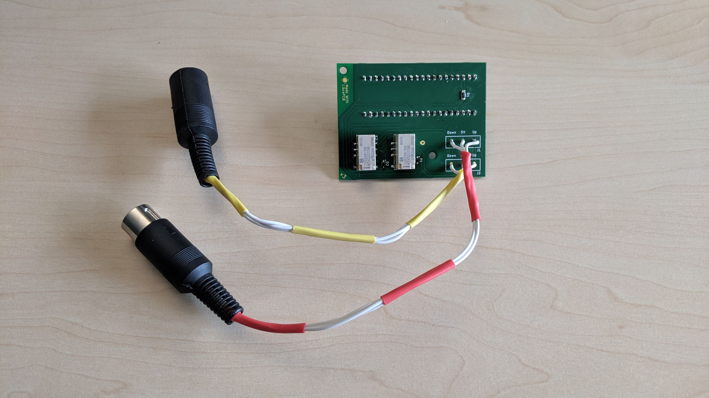
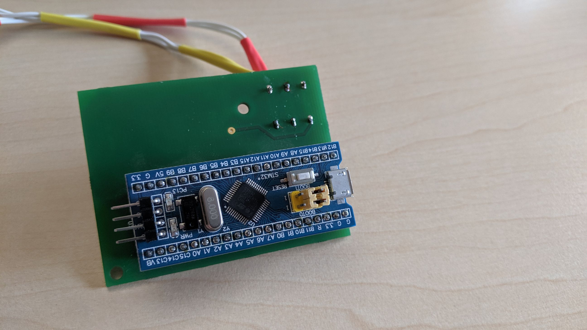

# desklift

A simple PCB to control an Actiforce desk lift from a Blue Pill STM32
microcontroller board using two low-current relays.

The PCB itself is designed mostly one-sided, you just need a single jumper wire
if you want a one-sided board. This makes it suitable for self-etching.

You can order the PCB [on Aisler](https://aisler.net/p/MNKNKKFU).

This is a [LibrePCB](http://librepcb.org) project!

## BOM

| Designator | Description | MPN | Approx. Cost |
| ---------- | ----------- | --- | ------------ |
| U1 | [STM32F103 "Blue Pill"](https://www.embedded-tools.ch/boards/stm/247/stm32f103c8t6-blue-pill-eval-board) | | 5.50 CHF |
| U1 | [Socket Strip 1x20](https://de.aliexpress.com/item/32996229462.html) | | 0.74 USD |
| K1, K2 | [Relay 3V 16.7mA](https://www.digikey.ch/product-detail/de/panasonic-electric-works/TXS2SA-3V/255-2341-5-ND/650160) | TXS2SA-3V | 4.56 CHF |
| J1 | [7-Pin DIN 45329 Connector M](https://de.aliexpress.com/item/32860020971.html) | | 0.37 USD |
| J2 | [7-Pin DIN 45329 Connector F](https://de.aliexpress.com/item/32860020971.html) | | 0.42 USD |
| D1, D2 | [Diode Schottky 30V 500mA](https://www.digikey.ch/product-detail/de/on-semiconductor/NSR0530HT1G/NSR0530HT1GOSCT-ND/5761654) | NSR0530HT1G | 0.16 CHF |
| R1 | Resistor 1.8K 3216 (1206) | | 0.02 CHF |
| PCB | [Printed Circuit Board](https://aisler.net/p/MNKNKKFU) | | 7.50 CHF |

Total material cost: ~24 USD

## License

See [LICENSE.txt](LICENSE.txt).
